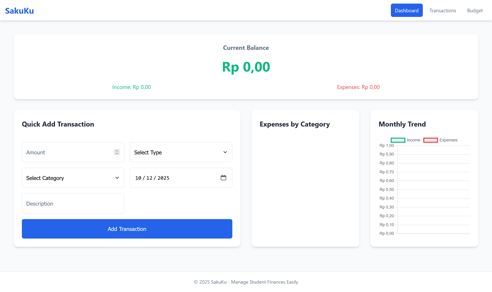
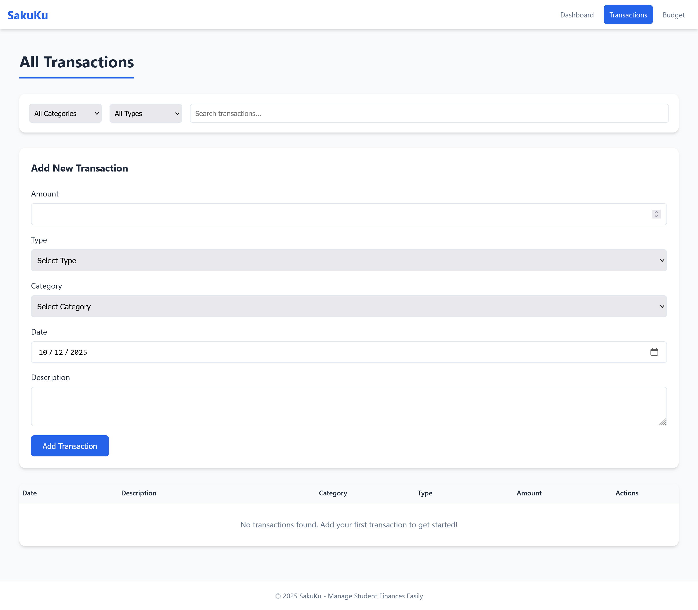
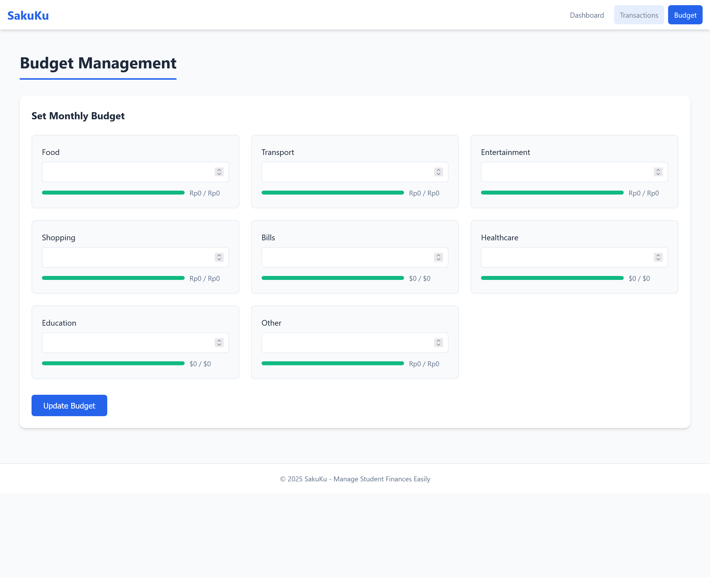

---

# SakuKu: Manage Student Finances Easily

SakuKu is a personal finance app designed specifically for students living away from home in Indonesia. This app helps students manage, view, and monitor their expenses easily.

## Tagline
"Manage Student Finances with Ease"

## 🌐 Live Demo
**Akses aplikasi langsung di:** [https://saku-ku.netlify.app/](https://saku-ku.netlify.app/)

## Target Users
- Students living away from home in Indonesia who live in boarding houses

## Features

### Dashboard
- Displays current balance (Income: Rp X, Expenses: Rp Y, Balance: Rp Z)

### Quick Add Transaction
- Quick form to add transactions by entering the amount, type, category, date, and description

### Transaction Management
- CRUD (Create, Read, Update, Delete) operations for transaction management
- Filters and search to find specific transactions

### Budget Management
- Budget settings per category
- Budget progress monitoring

### Data Visualization
- Pie Chart: Expenses per category
- Line Chart: Monthly trends

### Responsive Design
- Responsive design with layouts for mobile and desktop devices

### Data Persistence
- Use of LocalStorage to store data locally on the device

### Single-Page Application
- Single-page application structure with navigation between sections (Dashboard/Transactions/Budget)

## Screenshots

### Dashboard

*Dashboard utama menampilkan saldo saat ini, quick add transaction, expenses by category, dan monthly trend*

### Transactions

*Halaman transaksi dengan fitur filter, search, dan CRUD operations untuk mengelola semua transaksi*

### Budget Management

*Halaman pengelolaan budget untuk setiap kategori dengan progress monitoring*

## Technology Stack

- **Frontend**: HTML5, CSS3 (with CSS Grid and Flexbox), Vanilla JavaScript ES6+
- **Charts**: Chart.js library via CDN
- **Data Storage**: LocalStorage on user devices
- **Deployment**: Static hosting (Netlify/Vercel compatible)

## IBM Granite AI Utilization

- **HTML Structure Generation**: HTML structure created with the help of IBM Granite AI prompting
- **CSS Framework**: CSS framework generated with the help of IBM Granite AI
- **JavaScript Core Functions**: Main JavaScript function templates generated with the help of IBM Granite AI
- **Code Optimization**: Recommendations for code optimization
- **Development Acceleration**: Development process accelerated by approximately 70% with the help of IBM Granite AI
- **Total Prompts Used**: 4-5

## Setup Instructions

### Option 1: Access Live Demo (Recommended)
**Akses langsung aplikasi yang sudah di-deploy:** [https://saku-ku.netlify.app/](https://saku-ku.netlify.app/)

### Option 2: Run Locally
1. **Clone Repository**: `git clone [repo-url]`
2. **Open index.html**: Open `index.html` directly in a web browser (no server required)
3. **Start Adding Transactions**: Start adding transactions to see the functions
4. **Data Persistence**: Data will be stored locally in localStorage

## Project Structure

- **index.html**: Complete SPA structure
- **styles.css**: Responsive CSS framework
- **app.js**: Complete application logic with CRUD operations

--- 

SakuKu encourages students to manage their finances more easily and efficiently. With easy-to-use features and clear data visualization, SakuKu is an indispensable tool for students with limited budgets.

### Use SakuKu to:
- Effectively manage and view personal finances
- Set budgets for each expense category
- Identify monthly spending patterns and take action for better management

### Difficulty Level
SakuKu is designed to be easy to use, so students without significant technical experience can use it with ease.

--- 

Why SakuKu? Because finances are very important for students, and SakuKu makes the process of monitoring finances easy and efficient.

With SakuKu, students can be cleaner, healthier, and more focused on their studies!

## License

This project is licensed under the MIT License - see the [LICENSE](LICENSE) file for details.

## Contact

For any questions or suggestions, reach out to Davin at dsyabanp@gmail.com.
